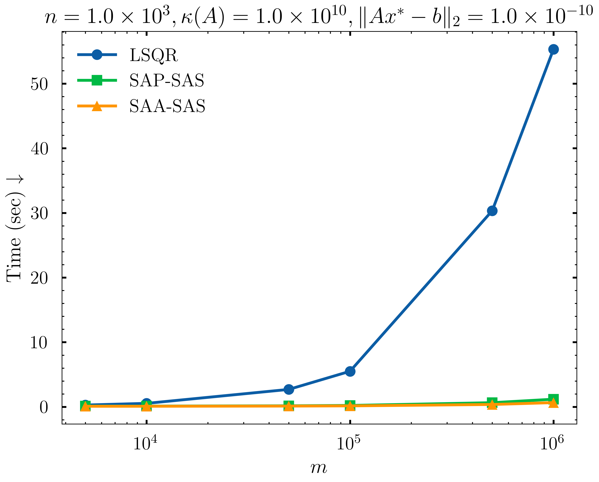

# Sketch 'n Solve

Sketch 'n Solve is a Python library that implements basic randomized numerical linear algebra (RandNLA) techniques for solving large-scale linear algebra problems. The library is designed to be user-friendly and easy to use, with a focus on simplicity and efficiency. The library is built on top of NumPy and SciPy, and provides a simple interface for creating sketched matrices and solving linear systems using randomized numerical linear algebra algorithms.

<p align="center">
    
</p>

# 📦 Features

## 🔥 Fast and Precise

Sketch 'n Solve is over 50 times faster than traditional methods for solving large-scale linear algebra problems while maintaining high accuracy (**notice how the forward error is much lower for Sketch 'n Solve than traditional LSQRwhich gets even worse for more ill-conditioned systems**). The library is designed to be efficient and scalable, making it ideal for solving large-scale linear algebra problems in a variety of applications. Don't believe me? Check out the benchmarks below (lower is better)!

<p align="center">
    
    
    
</p>

# 🚀 Getting Started 

## 📦 Installation

```bash
python -m venv .venv

# for general usage
python -m pip install .

# or for development
python -m pip install -e .
```

## 🛠️ Usage

### List of Available Sketch Functions

```python
from sketch_n_solve import sketch
sketch.Sketch.list_available_sketch_fns()

# for information about arguments for each sketch function use the help method in Python
# e.g. for dense sketch function
help(sketch.dense.normal)
# e.g. for sparse sketch function
help(sketch.sparse.clarkson_woodruff)
```


### ⚡️ Fast Sparse Sketch Operators

```python
import time
import numpy as np
import numpy.linalg as LA
from sketch_n_solve.solve.least_squares import LeastSquares

# Recommended to use either "clarkson_woodruff" or "uniform_sparse"
# for best results out of the box
sketch_fn = "clarkson_woodruff"
seed = 42
rng = np.random.default_rng(seed)
A = rng.standard_normal((1000000, 1000))
x = rng.standard_normal(1000)
b = A @ x
lsq = LeastSquares(sketch_fn, seed)

x_hat, _, istop, time_elapsed = lsq(A, b)

print("residual", LA.norm(A @ x_hat - A @ x))

is_close = np.allclose(x_hat, x)
print(f"x_hat is close to x => {is_close}")

print(f"Sketch and solve finished in {time_elapsed} seconds.")
```

### 🎨 Generate Sketch Matrix

You can also generate the sketch matrix and apply it to the input matrix `A` and the right-hand side `b` separately or for other downstream linear algebra tasks!

```python
import numpy as np
from sketch_n_solve.sketch import Sketch

sketch_fn = "normal"
seed = 42
sketch = Sketch(sketch_fn, seed)

rng = np.random.default_rng(seed)
A = rng.standard_normal((10000, 10))
b = rng.standard_normal(10000)

# Generate sketch matrix S
A, S = sketch(A)

# Use sketch matrix S to sketch A and b
SA = S @ A
Sb = S @ b

print(SA.shape, Sb.shape)  # SA: (10, 10), Sb: (10,)
```

